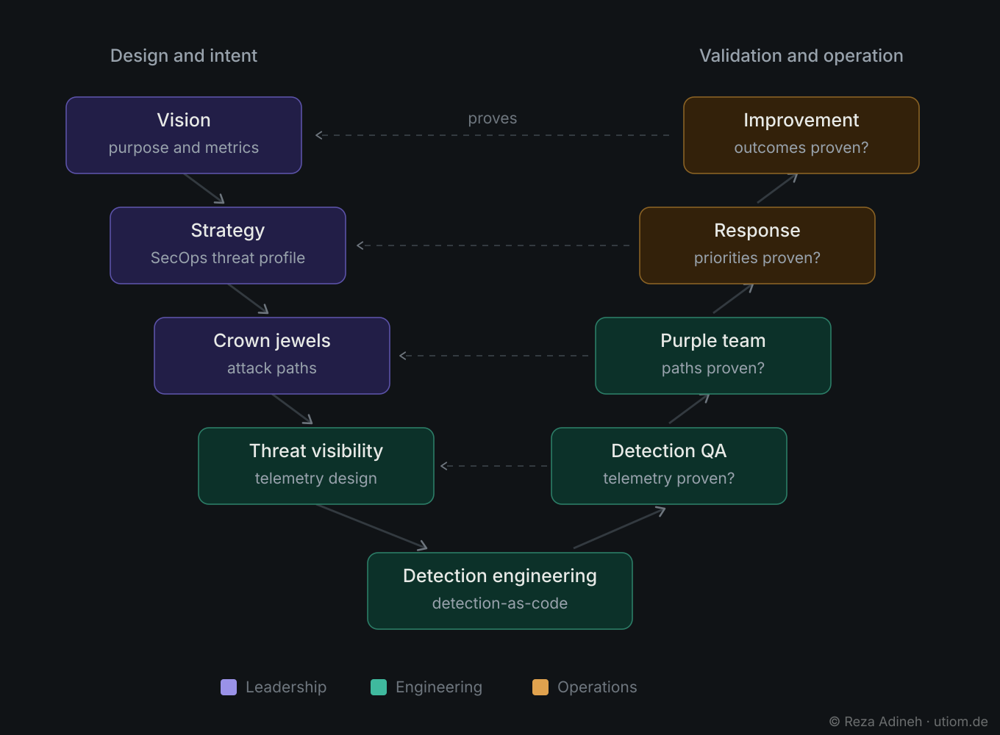

# UTIOM — Unified Threat-Informed Operations Model

**Security operations designed as one system, not disconnected silos.**

**Current public framework release: v1.3 · August 2026**  
**Canonical website: https://utiom.de**  
**License: Creative Commons Attribution-ShareAlike 4.0 International (CC BY-SA 4.0)**

UTIOM is a lifecycle operating framework for cybersecurity and Security Operations Centers (SOCs). It connects leadership intent, threat understanding, engineering discipline, operational response and continuous improvement into one measurable, threat-informed system.

The model is built around a simple premise: security operations should not begin with tools, telemetry volume, alert counts or isolated controls. They should begin with purpose, business consequence and relevant threats, then engineer the visibility, detection and response capabilities required to protect what matters.

> **Purpose first → strategy first → business consequence → relevant threats → attack paths → required evidence → engineered visibility → engineered detection → operational response → measurable improvement.**

UTIOM treats security operations as a **living product**, a **living system**, and an **operating model for the security program** rather than a collection of independent SOC functions.

---

## Core diagrams

### UTIOM operating model

The operating model shows the three pillars, seven canonical phases, the engineering/operations OODA loop and the strategic decision-making feedback loop.

### UTIOM V-Model

The V-model pairs design and intent on the left with validation and operation on the right. Each major design decision must be proven operationally rather than accepted as an assumption.

---

## Canonical UTIOM lifecycle

UTIOM has exactly seven lifecycle phases:

1. **Vision**
2. **Strategy**
3. **Crown Jewels**
4. **Threat Visibility**
5. **Threat Detection**
6. **Response**
7. **Continuous Improvement**

The lifecycle contains ordered dependencies, but it is **not a rigid waterfall**. Engineering, operations and validation run iteratively, and operational evidence continuously feeds back into leadership decisions and future engineering work.

---

## Three operating pillars

- **Leadership & Governance**
- **Engineering & Enablement**
- **Operations & Analysis**

The purpose of the pillars is not to create new silos. Their purpose is to make ownership clear while preserving one connected operating model.

---

## Threat-to-outcome traceability

A core UTIOM requirement is end-to-end traceability:

**Business purpose**  
→ **Security Operations Strategy**  
→ **Threat Profiling**  
→ **Crown Jewels & Critical Services**  
→ **Threat Models**  
→ **Dependencies & Trust Boundaries**  
→ **Attack Paths**  
→ **Required Adversary Evidence**  
→ **Telemetry Engineering / Assurance**  
→ **Threat Detection / Detection Engineering**  
→ **Detection Validation**  
→ **Analysis & Decision**  
→ **Response**  
→ **Metrics & Evidence**  
→ **Continuous Improvement**

If an important behaviour must be observable but the evidence does not exist, the gap becomes a **Telemetry Engineering requirement** rather than being passively accepted as a detection limitation.

---

## Validation is part of the operating model

UTIOM pairs design with evidence that the design works.

**Purple Teaming + Detection QA + Response Exercising** validate the chain:

**Attack path → telemetry → detection → alert → analysis → decision → response**

Validation findings belong to the phase that owns the weakness. Missing evidence belongs in Telemetry Engineering; a silent or noisy rule belongs in the detection lifecycle; slow decision-making belongs in authority and response design; systemic lessons belong in Continuous Improvement.

---

## Assessment and measurement

UTIOM includes public browser-based assessment instruments for maturity, capability, metrics and improvement planning. The objective is not maturity for its own sake, but measurable operational capability and demonstrable risk reduction.

The current public site provides:

- **Maturity Assessment — 50 staged criteria**
- **Capability Assessment — 105 indicators**
- **Metrics Calculator — 70 explicit metrics**
- **Improvement Roadmap**
- **Capability Dashboard**

The public assessment tools run in the browser and are designed so assessment answers are not transmitted to a UTIOM backend.

Start at: https://utiom.de

---

## Framework family

UTIOM is the overarching operating model. Supporting models add measurement depth or decision context without becoming additional UTIOM lifecycle phases.

- **TID-CMM — Threat-Informed Detection Capability Maturity Model** — https://tid-cmm.com
- **TIR-CMM — Threat-Informed Response Capability Maturity Model** — https://tir-cmm.com
- **RSMM — Realistic SIEM Maturity Model**
- **KEVMAP** — known-exploited-vulnerability and exposure context — https://kevmap.io

---

## Relationship to established standards

UTIOM does **not** replace MITRE ATT&CK, NIST, ISO, NIS2, DORA, SOC-CMM or other established frameworks and regulations.

It provides an operating model that helps translate governance, threat knowledge, engineering and response requirements into connected operational work.

---

## Repository scope and public/private boundary

This repository is the **public framework and community repository** for UTIOM.

It may contain:

- framework doctrine and terminology;
- lifecycle and pillar documentation;
- public diagrams;
- public mappings;
- implementation guidance and examples;
- assessment descriptions;
- research and citation material;
- change history.

It intentionally does **not** expose the source code or operational details of the production UTIOM service. Production deployment configuration, infrastructure details, credentials, private automation, administrative functionality, internal APIs and non-public implementation material belong in separate private repositories.

**A publicly available framework or free service does not imply that the production implementation is open source.**

---

## Author

**Reza Adineh**  
Creator of the Unified Threat-Informed Operations Model (UTIOM)

Website: https://utiom.de  
Author: https://rezaadineh.com

**Think smarter. Stay secure.**
